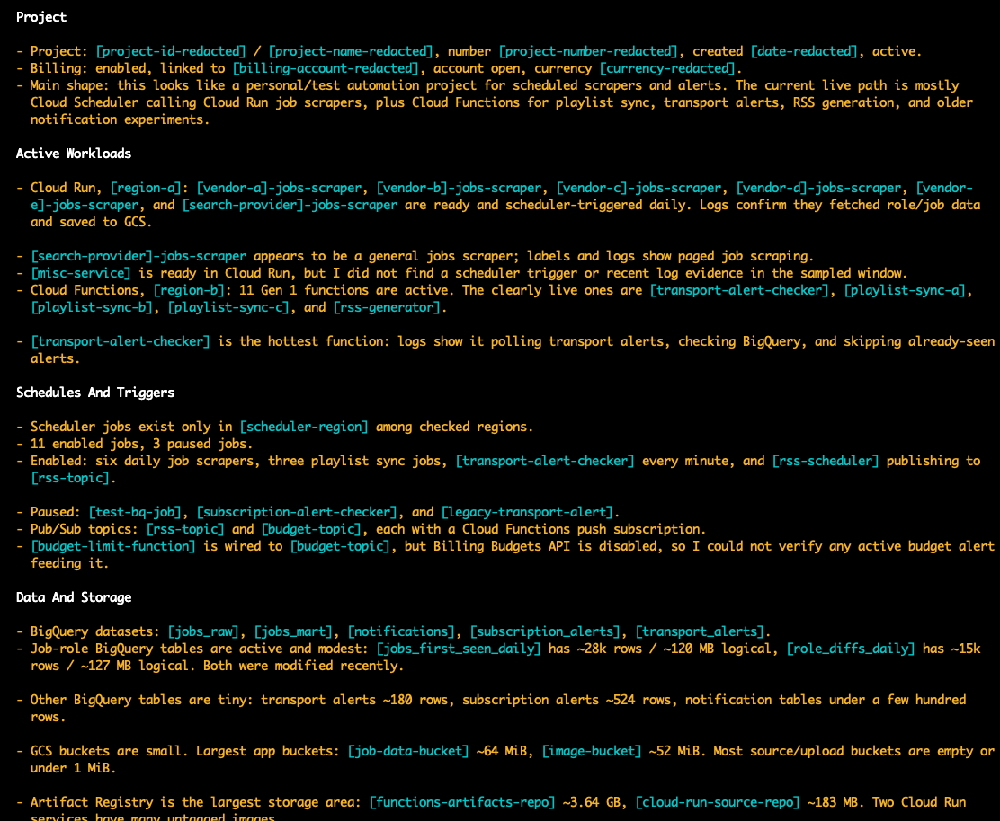

# GCP Project Refresher

A skill for producing a practical 101-style overview of a Google Cloud project from read-only `gcloud` inventory.

## What It Does

This skill helps answer: "What is running in this GCP project, what does it appear to do, and what might be inactive or costing money?"

It checks project identity, billing linkage, enabled APIs, live resources, schedules, storage, messaging, builds, logs, and likely cleanup candidates. It separates observed evidence from inference, so names, triggers, logs, and storage links are called out with appropriate confidence.

## Requirements

- `gcloud` CLI installed
- Authenticated Google Cloud account
- Permission to run read-only inventory, logging, and billing commands
- A target GCP project ID

## Example Prompt

```text
Review this GCP project with gcloud and give me a 101 refresher: project=PROJECT_ID
```

If no project is provided, the skill first checks the active `gcloud` config and asks only if the project is still ambiguous.

## Example Output



## Output

The briefing typically includes:

- Project identity and billing status
- Main mental model of what the project does
- Active workloads, schedules, and triggers
- Storage, data, and messaging resources
- Billing and cost clues
- Dormant resources and cleanup candidates
- Commands that failed or limits of the review

## Files

- `SKILL.md` - Core workflow and reporting rules
- `references/recommended-commands.md` - Read-only command checklist and output guidance
